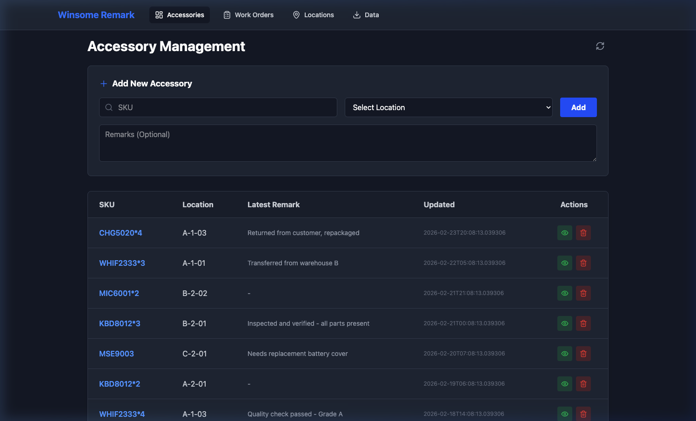
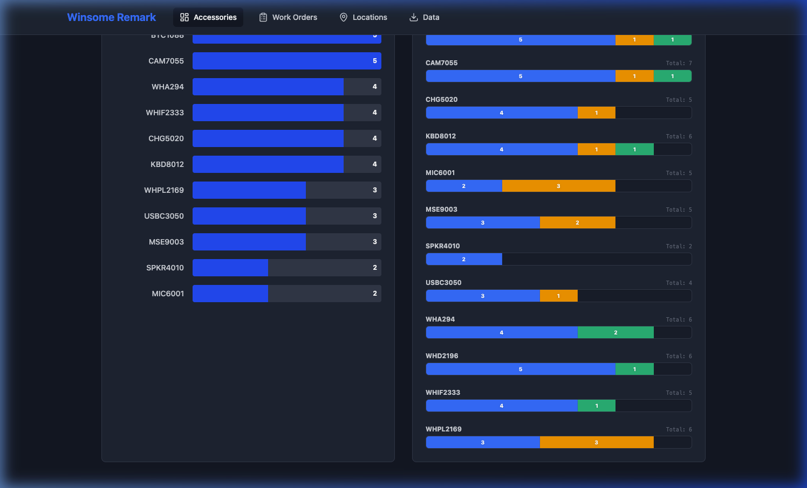
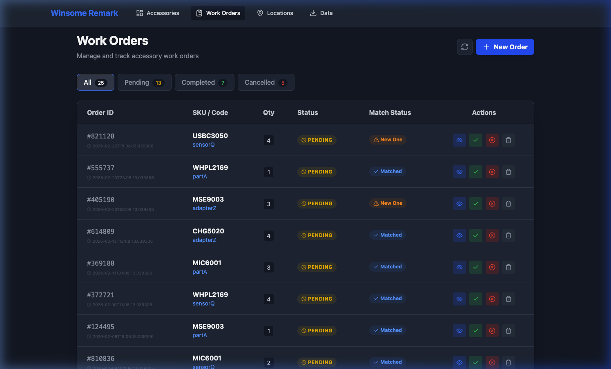
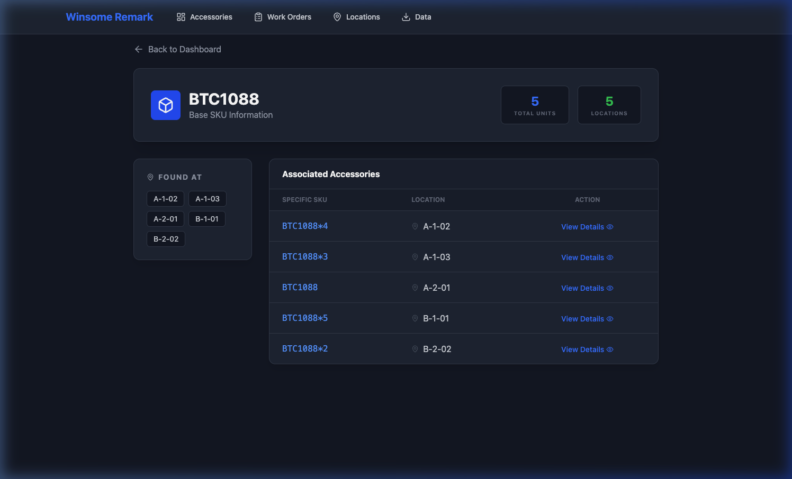
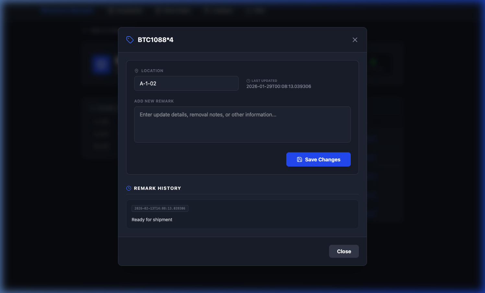
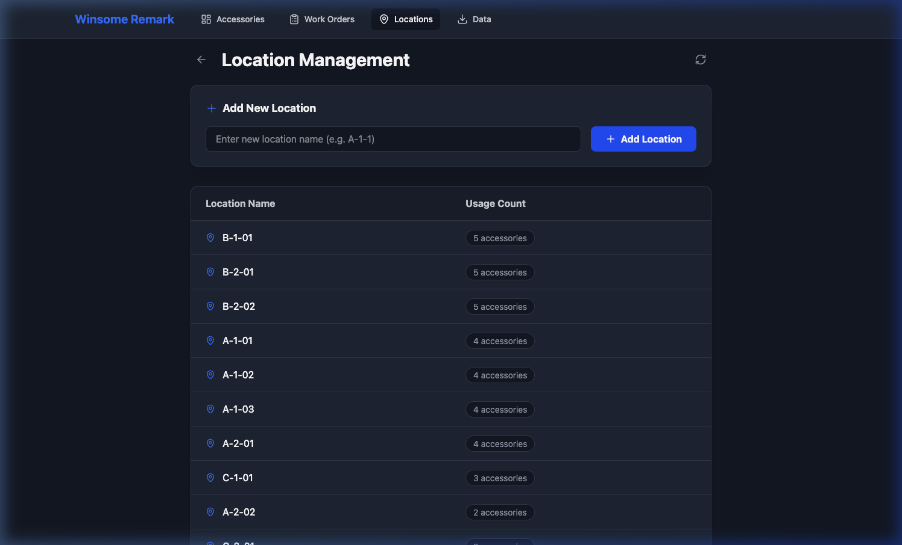
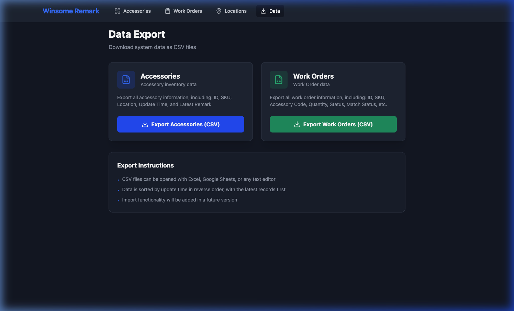

<p align="center">
  <h1 align="center">✨ Winsome Remark</h1>
  <p align="center">
    <strong>A Modern Accessory & Inventory Management System</strong>
  </p>
  <p align="center">
    Built with Flask · React · TypeScript · SQLite
  </p>
</p>

---

**Winsome Remark** is a full-featured inventory and work order management platform designed for teams that need to track accessories, manage warehouse locations, and coordinate fulfillment workflows — all from a sleek, dark-themed web interface.

## 🖥️ Application Overview

### 📦 Accessory Management Dashboard

The main dashboard provides a centralized view of your entire accessory inventory. Quickly add new items with SKU auto-suggestion, assign warehouse locations, and attach remarks for tracking notes.



**Key capabilities:**
- **Smart SKU Input** — Auto-complete suggestions based on existing SKUs
- **Location Assignment** — Dropdown selection from your managed locations
- **Remark System** — Attach notes, quality reports, or status updates to any item
- **Paginated Inventory Table** — Browse large inventories efficiently with sortable columns

---

### 📊 Analytics & Insights

Scroll down on the dashboard to reveal powerful analytics panels that give you instant visibility into your inventory health and work order distribution.



**What you get:**
- **SKU Statistics** — Bar chart showing inventory counts per SKU, grouped by base SKU
- **Inventory vs Work Orders (Stacked)** — Visual comparison of on-hand inventory, pending orders, and completed orders per SKU
- **At-a-Glance Totals** — Quickly spot which SKUs are over- or under-stocked relative to demand

---

### 📋 Work Order Management

A complete work order lifecycle system — from creation to completion or cancellation. Filter by status, view match results against inventory, and take action directly from the table.



**Highlights:**
- **Status Tracking** — Pending, Completed, and Cancelled states with color-coded badges
- **Auto-Matching Engine** — Automatically matches work orders to available inventory by SKU
- **Match Status Indicators** — Instantly see which orders are matched vs. which need new units
- **Bulk Actions** — Complete, cancel, or delete orders with one click
- **Customer Service Assignment** — Track which team member owns each order

---

### 🔍 SKU Detail & Drill-Down

Click any SKU to dive into a detailed view showing all associated accessories, their warehouse locations, and unit counts.



**Features:**
- **Unit Summary** — Total units and number of distinct storage locations at a glance
- **Location Map** — See exactly where each unit is stored
- **Associated Accessories Table** — View every variant of the SKU with direct links to individual item details

---

### 🏷️ Accessory Detail & Remark History

Open any accessory to view its full history. Update its location, add new remarks, and review the complete remark timeline.



**Capabilities:**
- **Location Editing** — Reassign an item to a different warehouse slot
- **Remark History** — Full chronological log of all notes, inspections, and status changes
- **Timestamped Audit Trail** — Every update is tracked with precise timestamps

---

### 📍 Location Management

Manage your warehouse grid with a dedicated location management page. Add new storage locations and monitor usage across your inventory.



**Features:**
- **Add New Locations** — Create storage slots with simple naming conventions (e.g. A-1-01)
- **Usage Tracking** — See how many accessories are stored at each location
- **Sorted by Usage** — Most-used locations appear first for quick reference

---

### 📤 Data Export

Export your inventory and work order data as CSV files for reporting, analysis, or integration with other tools.



**Export options:**
- **Accessories CSV** — ID, SKU, Location, Update Time, Latest Remark
- **Work Orders CSV** — Full order details including status, match status, and timestamps
- **Timestamped Filenames** — Each export generates a uniquely named file for version control

---

## 🚀 Getting Started

### Prerequisites

- **Python 3.10+**
- **Node.js 18+**

### Installation

1. **Clone the repository**

   ```
   git clone https://github.com/woody1983/Takhisis.git
   cd Takhisis
   ```

2. **Set up the Python backend**

   ```
   python -m venv venv
   source venv/bin/activate
   pip install -r requirements.txt
   ```

3. **Set up the React frontend**

   ```
   cd frontend-v2
   npm install
   npm run build
   cd ..
   ```

4. **Start the application**

   ```
   python app.py
   ```

5. **Open your browser** → `http://127.0.0.1:5003`

> 💡 **Development mode:** Run `npm run dev` in the `frontend-v2` directory for hot-reload during frontend development (`http://localhost:5173`).

---

## 🏗️ Architecture

| Layer | Technology | Purpose |
|-------|-----------|---------|
| **Frontend** | React + TypeScript + Vite | Modern SPA with component-based UI |
| **Styling** | Tailwind CSS | Dark-themed, responsive design |
| **Backend** | Flask (Python) | RESTful API serving JSON endpoints |
| **Database** | SQLite | Lightweight embedded database |
| **Charts** | Pure CSS | No external charting library needed |

---

## 🔮 Extensibility & Roadmap

Winsome Remark is designed with a modular architecture that makes it easy to extend with new features:

- 📥 **CSV Import** — Bulk upload accessories and work orders from spreadsheets
- 🔐 **User Authentication** — Role-based access for admins, warehouse staff, and CS agents
- 📱 **Mobile Responsive** — Optimized layouts for tablet and phone use in the warehouse
- 🔔 **Notifications** — Real-time alerts when inventory runs low or work orders age
- 🏷️ **Barcode / QR Scanning** — Camera-based scanning for quick item lookup
- 📈 **Advanced Analytics** — Trend analysis, forecasting, and custom report builder
- 🔗 **API Integrations** — Connect to ERP, shipping, or e-commerce platforms
- 🌍 **Multi-Language Support** — i18n framework for global teams
- 🗄️ **Database Migration** — Easy upgrade path to PostgreSQL or MySQL for scale

> The REST API is fully documented and can serve as the backbone for any custom frontend or mobile application.

---

## 📄 License

This project is for internal use. Contact the repository owner for licensing inquiries.
